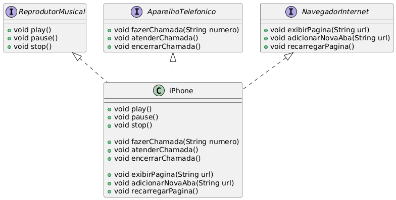

# Desafio de Projeto: Modelando o iPhone com UML: Funções de Músicas, Chamadas e Internet

Este projeto em Java representa um iPhone que implementa as funcionalidades de um Reprodutor Musical, Aparelho Telefônico e Navegador Web. Cada funcionalidade é representada por uma interface, e a classe `iPhone` implementa essas interfaces, combinando as funcionalidades em um único dispositivo.

## Estrutura do Projeto

### Interfaces

- **ReprodutorMusical**: Define os métodos essenciais para um reprodutor musical, como `play`, `pause`, e `stop`.
- **AparelhoTelefonico**: Define os métodos necessários para realizar e gerenciar chamadas telefônicas, como `fazerChamada`, `atenderChamada`, e `encerrarChamada`.
- **NavegadorInternet**: Define os métodos principais de um navegador de internet, como `exibirPagina`, `adicionarNovaAba`, e `recarregarPagina`.

### Classe `iPhone`

A classe `iPhone` implementa todas as interfaces mencionadas, combinando assim as funcionalidades de reprodutor musical, aparelho telefônico e navegador de internet em uma única classe.

## Diagrama de Classes

Abaixo está o diagrama de classes que representa a estrutura das interfaces e da classe `iPhone`:

    

